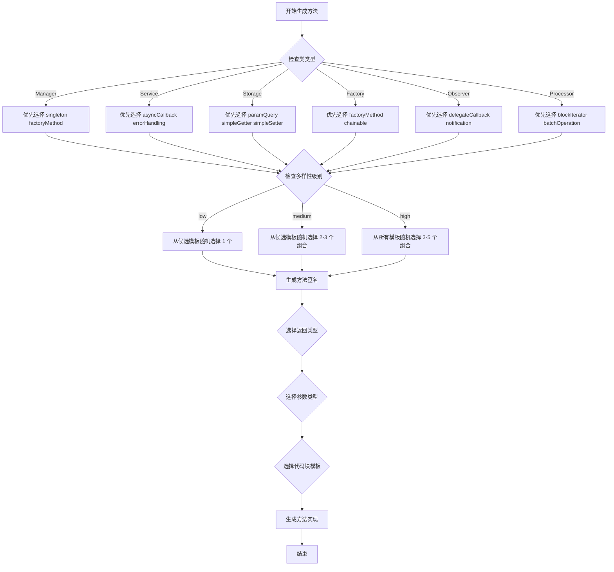
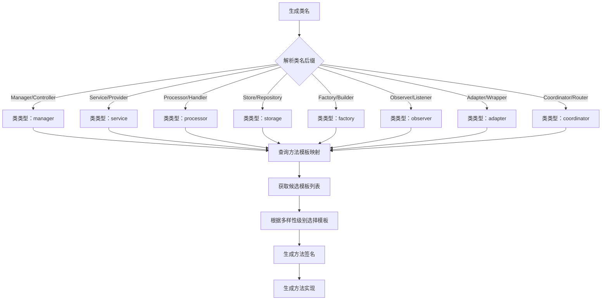
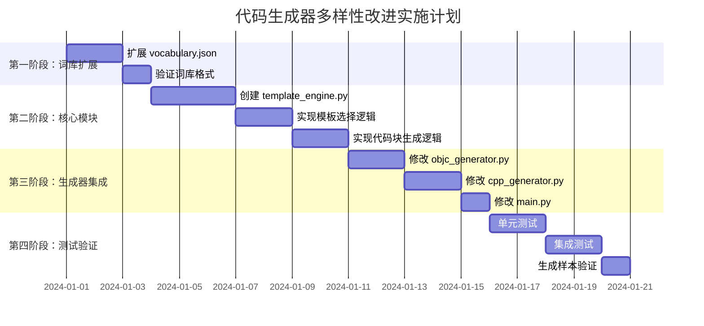

# iOS 插件代码生成器 - 多样性改进方案

## 1. 词库扩展设计

### 1.1 新增词库类别

在 [`config/vocabulary.json`](config/vocabulary.json) 中添加以下新类别：

```json
{
  "methodType": {
    "async": ["async", "sync", "background", "concurrent", "serial", "parallel"],
    "modifier": ["optional", "required", "cached", "validated", "deprecated", "available"],
    "pattern": ["delegate", "callback", "notification", "reactive", "promise", "future"],
    "visibility": ["public", "private", "protected", "internal", "class"]
  },
  "paramType": {
    "primitive": ["int", "float", "double", "BOOL", "NSUInteger", "NSInteger", "CGFloat", "uint8_t", "int32_t", "uint64_t"],
    "object": ["NSString *", "NSArray *", "NSDictionary *", "NSData *", "NSDate *", "NSNumber *", "NSSet *", "NSMutableArray *", "NSMutableDictionary *"],
    "block": ["void(^)(void)", "void(^)(id result)", "void(^)(NSError *error)", "BOOL(^)(id item)", "void(^)(NSUInteger count, id object)", "void(^)(BOOL success)", "void(^)(id result, NSError *error)"],
    "generic": ["id", "nullable id", "nonnull id", "Class", "SEL", "IMP"],
    "pointer": ["void *", "const void *", "char *", "const char *", "uint8_t *"],
    "enum": ["NSComparisonResult", "NSKeyValueChange", "NSRunLoopMode", "NSStringEncoding"],
    "struct": ["CGPoint", "CGSize", "CGRect", "UIEdgeInsets", "NSEdgeInsets"]
  },
  "returnType": {
    "primitive": ["int", "float", "double", "BOOL", "NSUInteger", "NSInteger", "CGFloat"],
    "object": ["NSString *", "NSArray *", "NSDictionary *", "NSData *", "NSDate *", "NSNumber *", "NSSet *", "id"],
    "optional": ["nullable NSString *", "nullable NSArray *", "nullable id", "nonnull NSString *"],
    "collection": ["NSArray<id> *", "NSDictionary<NSString *, id> *", "NSSet<id> *", "NSMutableArray *"],
    "errorHandling": ["nullable NSString *", "nullable id", "BOOL"],
    "async": ["void", "NSFuture *", "Promise *", "Task *"]
  },
  "classType": {
    "manager": ["Manager", "Controller", "Director", "Administrator", "Supervisor"],
    "service": ["Service", "Provider", "Supplier", "Facilitator", "Broker"],
    "processor": ["Processor", "Handler", "Executor", "Worker", "Operator"],
    "storage": ["Store", "Repository", "Database", "Cache", "Archive", "Vault"],
    "factory": ["Factory", "Builder", "Creator", "Generator", "Constructor", "Maker"],
    "observer": ["Observer", "Listener", "Subscriber", "Watcher", "Monitor", "Tracker"],
    "adapter": ["Adapter", "Wrapper", "Proxy", "Bridge", "Converter", "Transformer"],
    "coordinator": ["Coordinator", "Router", "Navigator", "Dispatcher", "Scheduler"]
  },
  "codeBlock": {
    "log": ["NSLog(@\"[Debug] %s\", __func__)", "NSLog(@\"[Info] %@ called\", NSStringFromClass([self class]))", "OSLog(@\"Method invoked: %s\", __func__)"],
    "validation": ["if (!self) return;", "NSParameterAssert(param);", "NSCParameterAssert([param isKindOfClass:[NSString class]]);"],
    "nullCheck": ["if (param == nil) { return; }", "if (param == nil) { return nil; }", "if (param == nil) { return NO; }", "if (param == nil) { return 0; }"],
    "errorHandling": ["NSError *error = nil;", "@try { } @catch (NSException *e) { NSLog(@\"Exception: %@\", e); }", "if (error) { *error = [NSError errorWithDomain:@\"com.error\" code:-1 userInfo:nil]; }"],
    "async": ["dispatch_async(dispatch_get_global_queue(DISPATCH_QUEUE_PRIORITY_DEFAULT, 0), ^{ })", "dispatch_async(dispatch_get_main_queue(), ^{ })", "NSOperationQueue *queue = [[NSOperationQueue alloc] init];"],
    "cache": ["static NSMutableDictionary *_cache = nil;", "if (!_cache) { _cache = [NSMutableDictionary dictionary]; }", "id cached = [_cache objectForKey:key];"],
    "loop": ["for (id item in collection) { }", "for (NSUInteger i = 0; i < count; i++) { }", "while (condition) { }", "[array enumerateObjectsUsingBlock:^(id obj, NSUInteger idx, BOOL *stop) { }]"],
    "condition": ["if (condition) { }", "if (condition) { } else { }", "switch (state) { case 1: break; default: break; }"],
    "memory": ["__weak typeof(self) weakSelf = self;", "__strong typeof(weakSelf) strongSelf = weakSelf;", "[self autorelease];"],
    "notification": ["[[NSNotificationCenter defaultCenter] postNotificationName:@\"Notification\" object:self];", "[[NSNotificationCenter defaultCenter] addObserver:self selector:@selector(handleNotification:) name:@\"Notification\" object:nil];"]
  }
}
```

### 1.2 词库结构图

```mermaid
graph TD
    A[vocabulary.json] --> B[class - 类名词库]
    A --> C[method - 方法词库]
    A --> D[property - 属性词库]
    A --> E[methodType - 方法类型词库 - 新增]
    A --> F[paramType - 参数类型词库 - 新增]
    A --> G[returnType - 返回类型词库 - 新增]
    A --> H[classType - 类类型词库 - 新增]
    A --> I[codeBlock - 代码块词库 - 新增]
    
    E --> E1[async: 异步修饰词]
    E --> E2[modifier: 方法修饰符]
    E --> E3[pattern: 设计模式词]
    E --> E4[visibility: 可见性]
    
    F --> F1[primitive: 基本类型]
    F --> F2[object: 对象类型]
    F --> F3[block: 闭包类型]
    F --> F4[generic: 泛型类型]
    F --> F5[pointer: 指针类型]
    F --> F6[struct: 结构体类型]
    
    G --> G1[primitive: 基本返回类型]
    G --> G2[object: 对象返回类型]
    G --> G3[optional: 可选返回类型]
    G --> G4[collection: 集合返回类型]
    G --> G5[errorHandling: 错误处理返回类型]
    
    H --> H1[manager: 管理类]
    H --> H2[service: 服务类]
    H --> H3[processor: 处理类]
    H --> H4[storage: 存储类]
    H --> H5[factory: 工厂类]
    H --> H6[observer: 观察者类]
    H --> H7[adapter: 适配器类]
    H --> H8[coordinator: 协调类]
```



---

## 2. 方法模板设计

### 2.1 方法模板类型（至少 10 种）

| 模板 ID | 模板名称 | 描述 | 签名示例 |
|---------|----------|------|----------|
| T01 | simpleGetter | 简单 getter 方法 | `- (NSString *)name;` |
| T02 | simpleSetter | 简单 setter 方法 | `- (void)setName:(NSString *)name;` |
| T03 | paramQuery | 带参数的查询方法 | `- (id)objectForKey:(NSString *)key;` |
| T04 | asyncCallback | 带回调的异步方法 | `- (void)loadDataWithCompletion:(void(^)(id result, NSError *error))completion;` |
| T05 | blockIterator | 带 block 的遍历方法 | `- (void)enumerateObjectsUsingBlock:(void(^)(id obj, NSUInteger idx, BOOL *stop))block;` |
| T06 | errorHandling | 带错误处理的方法 | `- (BOOL)saveWithError:(NSError **)error;` |
| T07 | genericMethod | 泛型方法 | `- (NSArray<id> *)filterWithPredicate:(NSPredicate *)predicate;` |
| T08 | chainable | 链式调用方法 | `- (instancetype)setOption:(NSString *)option;` |
| T09 | factoryMethod | 工厂方法 | `+ (instancetype)managerWithConfig:(NSDictionary *)config;` |
| T10 | singleton | 单例方法 | `+ (instancetype)sharedManager;` |
| T11 | delegateCallback | 代理回调方法 | `- (void)processWithDelegate:(id<DelegateProtocol>)delegate;` |
| T12 | notification | 通知方法 | `- (void)postNotificationWithName:(NSString *)name;` |
| T13 | asyncAwait | 异步等待方法 | `- (void)fetchWithTimeout:(NSTimeInterval)timeout completion:(void(^)(id))completion;` |
| T14 | batchOperation | 批量操作方法 | `- (void)processItems:(NSArray *)items batchHandler:(void(^)(NSUInteger))handler;` |
| T15 | conditional | 条件执行方法 | `- (void)executeIfReady:(BOOL)ready handler:(void(^)(void))handler;` |

### 2.2 方法模板详细设计

```json
{
  "methodTemplates": {
    "simpleGetter": {
      "signature": "- ({return_type}){method_name};",
      "return_types": ["NSString *", "NSArray *", "NSDictionary *", "id", "NSInteger", "BOOL"],
      "params": [],
      "body_template": "return self->{ivar_name};"
    },
    "simpleSetter": {
      "signature": "- (void)set{capitalized_name}:(param_type){param_name};",
      "return_types": ["void"],
      "params": [{"name": "value", "type": "param_type"}],
      "body_template": "_{param_name} = {param_name};"
    },
    "paramQuery": {
      "signature": "- ({return_type}){method_name}With{param_name}:(param_type){param_name};",
      "return_types": ["id", "nullable id", "NSString *", "NSArray *"],
      "params": [{"name": "key", "type": "NSString *"}],
      "body_template": "return [self.data objectForKey:{param_name}];"
    },
    "asyncCallback": {
      "signature": "- (void){method_name}WithCompletion:(void(^)(return_type result, NSError *error))completion;",
      "return_types": ["id", "NSString *", "NSArray *", "BOOL"],
      "params": [{"name": "completion", "type": "void(^)(id, NSError *)"}],
      "body_template": "dispatch_async(dispatch_get_global_queue(0, 0), ^{ {code_block} if (self.completion) { self.completion(result, nil); } });"
    },
    "errorHandling": {
      "signature": "- (BOOL){method_name}WithError:(NSError **)error;",
      "return_types": ["BOOL"],
      "params": [{"name": "error", "type": "NSError **"}],
      "body_template": "if (!{condition}) { if (error) *error = [NSError errorWithDomain:@\"com.error\" code:-1 userInfo:nil]; return NO; } return YES;"
    },
    "factoryMethod": {
      "signature": "+ (instancetype){method_name}With{param_name}:(param_type){param_name};",
      "return_types": ["instancetype"],
      "params": [{"name": "config", "type": "NSDictionary *"}],
      "body_template": "instancetype instance = [[self alloc] init]; [instance configure:{param_name}]; return instance;"
    },
    "singleton": {
      "signature": "+ (instancetype){method_name};",
      "return_types": ["instancetype"],
      "params": [],
      "body_template": "static instancetype _instance = nil; static dispatch_once_t onceToken; dispatch_once(&onceToken, ^{ _instance = [[self alloc] init]; }); return _instance;"
    },
    "chainable": {
      "signature": "- (instancetype){method_name}:(param_type){param_name};",
      "return_types": ["instancetype"],
      "params": [{"name": "value", "type": "id"}],
      "body_template": "_{param_name} = {param_name}; return self;"
    },
    "blockIterator": {
      "signature": "- (void){method_name}UsingBlock:(void(^)(id obj, NSUInteger idx, BOOL *stop))block;",
      "return_types": ["void"],
      "params": [{"name": "block", "type": "void(^)(id, NSUInteger, BOOL *)"}],
      "body_template": "for (NSUInteger i = 0; i < self.items.count; i++) { if (block) { BOOL stop = NO; block(self.items[i], i, &stop); if (stop) break; } }"
    },
    "delegateCallback": {
      "signature": "- (void){method_name}WithDelegate:(id<DelegateProtocol>)delegate;",
      "return_types": ["void"],
      "params": [{"name": "delegate", "type": "id"}],
      "body_template": "if ([self.delegate respondsToSelector:@selector(didComplete:)]) { [self.delegate didComplete:self]; }"
    }
  }
}
```

### 2.3 方法模板选择流程图



---

## 3. 类类型与方法映射设计

### 3.1 类类型定义

| 类类型 | 后缀词 | 职责描述 | 典型方法 |
|--------|--------|----------|----------|
| Manager | Manager/Controller/Director | 管理生命周期和状态 | 单例、配置、启动/停止 |
| Service | Service/Provider/Supplier | 提供业务逻辑服务 | 异步调用、错误处理 |
| Processor | Processor/Handler/Executor | 处理数据和任务 | 批量处理、转换、验证 |
| Storage | Store/Repository/Cache | 数据存储和检索 | CRUD、查询、缓存 |
| Factory | Factory/Builder/Generator | 创建对象实例 | 工厂方法、构建器模式 |
| Observer | Observer/Listener/Tracker | 监听和响应事件 | 代理回调、通知 |
| Adapter | Adapter/Wrapper/Proxy | 适配和转换接口 | 转换、代理、桥接 |
| Coordinator | Coordinator/Router/Dispatcher | 协调多个组件 | 路由、调度、分发 |

### 3.2 类类型 - 方法模板映射表

```json
{
  "classTypeMethodMapping": {
    "manager": {
      "templates": ["singleton", "simpleGetter", "simpleSetter", "paramQuery", "errorHandling"],
      "required_methods": ["sharedManager", "initWithConfig:"],
      "optional_methods": ["start", "stop", "reset", "configure:"],
      "return_type_weights": {"instancetype": 0.3, "void": 0.3, "BOOL": 0.2, "id": 0.2}
    },
    "service": {
      "templates": ["asyncCallback", "errorHandling", "paramQuery", "blockIterator"],
      "required_methods": ["executeWithCompletion:", "processWithError:"],
      "optional_methods": ["cancel", "retry", "setDelegate:"],
      "return_type_weights": {"void": 0.4, "BOOL": 0.3, "id": 0.2, "NSString *": 0.1}
    },
    "processor": {
      "templates": ["blockIterator", "batchOperation", "conditional", "paramQuery"],
      "required_methods": ["process:", "processWithBlock:"],
      "optional_methods": ["validate:", "transform:", "filter:"],
      "return_type_weights": {"id": 0.3, "void": 0.3, "BOOL": 0.2, "NSArray *": 0.2}
    },
    "storage": {
      "templates": ["simpleGetter", "simpleSetter", "paramQuery", "errorHandling"],
      "required_methods": ["objectForKey:", "setObject:forKey:"],
      "optional_methods": ["removeObjectForKey:", "clear", "count", "containsKey:"],
      "return_type_weights": {"id": 0.3, "void": 0.3, "BOOL": 0.2, "NSUInteger": 0.2}
    },
    "factory": {
      "templates": ["factoryMethod", "chainable", "singleton"],
      "required_methods": ["create", "build"],
      "optional_methods": ["configure:", "setOption:", "reset"],
      "return_type_weights": {"instancetype": 0.5, "id": 0.3, "void": 0.2}
    },
    "observer": {
      "templates": ["delegateCallback", "notification", "simpleSetter"],
      "required_methods": ["setDelegate:", "notifyObservers"],
      "optional_methods": ["addObserver:", "removeObserver:", "postNotification:"],
      "return_type_weights": {"void": 0.6, "BOOL": 0.2, "id": 0.2}
    },
    "adapter": {
      "templates": ["paramQuery", "simpleGetter", "conditional"],
      "required_methods": ["adapt:", "convert:"],
      "optional_methods": ["wrap:", "unwrap:", "bridgeTo:"],
      "return_type_weights": {"id": 0.4, "void": 0.3, "NSString *": 0.2, "BOOL": 0.1}
    },
    "coordinator": {
      "templates": ["asyncCallback", "delegateCallback", "batchOperation"],
      "required_methods": ["coordinate:", "dispatch:"],
      "optional_methods": ["route:", "schedule:", "cancel:"],
      "return_type_weights": {"void": 0.4, "BOOL": 0.3, "id": 0.2, "NSUInteger": 0.1}
    }
  }
}
```

### 3.3 类类型识别与映射流程



---

## 4. 代码实现逻辑设计

### 4.1 模板引擎架构

创建新模块 [`core/template_engine.py`](core/template_engine.py)：

```python
"""
模板引擎模块
负责管理方法模板、参数组合和实现逻辑块
"""

from typing import Dict, List, Any, Optional, Tuple
import random


class TemplateEngine:
    """模板引擎类"""
    
    def __init__(self, vocabulary: Dict[str, Any], config: Dict[str, Any]):
        """
        初始化模板引擎
        
        Args:
            vocabulary: 词库配置
            config: 生成器配置
        """
        self.vocabulary = vocabulary
        self.config = config
        self.random = random.Random()
        self.method_templates = self._load_method_templates()
        self.code_blocks = vocabulary.get("codeBlock", {})
    
    def set_seed(self, seed: int):
        """设置随机种子"""
        self.random.seed(seed)
    
    def _load_method_templates(self) -> Dict[str, Dict]:
        """加载方法模板配置"""
        return {
            "simpleGetter": {...},
            "simpleSetter": {...},
            # ... 其他模板
        }
    
    def select_method_template(
        self,
        class_type: str,
        diversity_level: str = "medium",
        method_index: int = 0
    ) -> Dict[str, Any]:
        """
        根据类类型和多样性级别选择方法模板
        
        Args:
            class_type: 类类型 (manager/service/storage 等)
            diversity_level: 多样性级别 (low/medium/high)
            method_index: 方法索引（用于确定是第几个方法）
            
        Returns:
            选中的方法模板
        """
        # 获取类类型对应的模板映射
        mapping = self.config.get("classTypeMethodMapping", {}).get(class_type, {})
        candidate_templates = mapping.get("templates", [])
        
        if not candidate_templates:
            # 如果没有特定映射，从所有模板中随机选择
            candidate_templates = list(self.method_templates.keys())
        
        # 根据多样性级别确定选择数量
        if diversity_level == "low":
            select_count = 1
        elif diversity_level == "medium":
            select_count = self.random.randint(2, 3)
        else:  # high
            select_count = self.random.randint(3, 5)
        
        # 随机选择模板
        selected_templates = self.random.sample(
            candidate_templates,
            min(select_count, len(candidate_templates))
        )
        
        # 根据方法索引循环选择
        template_key = selected_templates[method_index % len(selected_templates)]
        return self.method_templates[template_key]
    
    def generate_method_signature(
        self,
        template: Dict[str, Any],
        method_name: str,
        class_name: str
    ) -> Tuple[str, List[Dict]]:
        """
        根据模板生成方法签名
        
        Args:
            template: 方法模板
            method_name: 方法名
            class_name: 类名
            
        Returns:
            (方法签名字符串，参数列表)
        """
        # 选择返回类型
        return_type = self._select_return_type(template)
        
        # 生成参数
        params = self._generate_params(template)
        
        # 构建签名
        signature = template["signature"].format(
            return_type=return_type,
            method_name=method_name,
            capitalized_name=method_name.capitalize(),
            param_name=params[0]["name"] if params else "value",
            param_type=params[0]["type"] if params else "id",
            ivar_name=f"_{method_name}"
        )
        
        return signature, params
    
    def _select_return_type(self, template: Dict[str, Any]) -> str:
        """选择返回类型"""
        return_types = template.get("return_types", ["void"])
        return self.random.choice(return_types)
    
    def _generate_params(self, template: Dict[str, Any]) -> List[Dict]:
        """生成参数列表"""
        params = []
        template_params = template.get("params", [])
        
        for param_template in template_params:
            param_type = param_template.get("type", "id")
            param_name = param_template.get("name", "param")
            
            # 如果是 block 类型，从词库中选择合适的 block
            if "block" in param_type or "^" in param_type:
                block_types = self.vocabulary.get("paramType", {}).get("block", [])
                if block_types:
                    param_type = self.random.choice(block_types)
            
            params.append({
                "name": f"{param_name}",
                "type": param_type
            })
        
        return params
    
    def generate_method_body(
        self,
        template: Dict[str, Any],
        params: List[Dict],
        return_type: str,
        complexity: int = 1
    ) -> List[str]:
        """
        根据模板生成方法体
        
        Args:
            template: 方法模板
            params: 参数列表
            return_type: 返回类型
            complexity: 复杂度等级
            
        Returns:
            方法体行列表
        """
        body_lines = []
        body_template = template.get("body_template", "// TODO: Implement")
        
        # 根据复杂度添加额外的代码块
        if complexity >= 2:
            # 添加日志
            log_blocks = self.code_blocks.get("log", [])
            if log_blocks:
                body_lines.append(self.random.choice(log_blocks))
                body_lines.append("")
        
        if complexity >= 3:
            # 添加验证
            validation_blocks = self.code_blocks.get("validation", [])
            if validation_blocks:
                body_lines.append(self.random.choice(validation_blocks))
                body_lines.append("")
            
            # 添加空值检查
            null_checks = self.code_blocks.get("nullCheck", [])
            if null_checks and params:
                body_lines.append(self.random.choice(null_checks))
                body_lines.append("")
        
        # 添加主体逻辑
        body_lines.append(body_template)
        
        # 添加返回值
        if return_type != "void":
            return_value = self._get_default_return_value(return_type)
            body_lines.append(f"return {return_value};")
        
        return body_lines
    
    def _get_default_return_value(self, return_type: str) -> str:
        """获取返回类型的默认值"""
        if return_type in ["int", "NSInteger", "NSUInteger", "long", "short"]:
            return "0"
        elif return_type in ["float", "double", "CGFloat"]:
            return "0.0f"
        elif return_type == "BOOL":
            return "YES"
        elif return_type in ["NSString *", "id"]:
            return "nil"
        elif return_type in ["NSArray *", "NSDictionary *", "NSSet *"]:
            return "@[]" if "Array" in return_type or "Set" in return_type else "@{}"
        elif return_type == "instancetype":
            return "self"
        else:
            return "nil"
    
    def detect_class_type(self, class_name: str) -> str:
        """
        根据类名检测类类型
        
        Args:
            class_name: 类名
            
        Returns:
            类类型字符串
        """
        class_type_vocab = self.vocabulary.get("classType", {})
        
        for class_type, suffixes in class_type_vocab.items():
            for suffix in suffixes:
                if class_name.endswith(suffix):
                    return class_type
        
        # 默认返回 processor
        return "processor"
```

### 4.2 代码块模板库

```json
{
  "codeBlockTemplates": {
    "logging": [
      {
        "id": "log_debug",
        "template": "NSLog(@\"[DEBUG] %s called\", __func__);",
        "complexity": 1
      },
      {
        "id": "log_info",
        "template": "NSLog(@\"[INFO] %@: %s\", NSStringFromClass([self class]), __func__);",
        "complexity": 1
      },
      {
        "id": "log_timing",
        "template": "NSDate *start = [NSDate date];\\n// ... operation ...\\nNSLog(@\"Elapsed: %f ms\", -[start timeIntervalSinceNow] * 1000);",
        "complexity": 3
      }
    ],
    "validation": [
      {
        "id": "assert_param",
        "template": "NSParameterAssert({param_name});",
        "complexity": 2
      },
      {
        "id": "check_class",
        "template": "NSCParameterAssert([{param_name} isKindOfClass:[NSString class]]);",
        "complexity": 2
      },
      {
        "id": "check_self",
        "template": "if (!self) return;",
        "complexity": 1
      }
    ],
    "async": [
      {
        "id": "dispatch_global",
        "template": "dispatch_async(dispatch_get_global_queue(DISPATCH_QUEUE_PRIORITY_DEFAULT, 0), ^{\\n    // Background work\\n});",
        "complexity": 2
      },
      {
        "id": "dispatch_main",
        "template": "dispatch_async(dispatch_get_main_queue(), ^{\\n    // UI update\\n});",
        "complexity": 2
      },
      {
        "id": "operation_queue",
        "template": "NSOperationQueue *queue = [[NSOperationQueue alloc] init];\\n[queue addOperationWithBlock:^{\\n    // Work\\n}];",
        "complexity": 3
      }
    ],
    "error_handling": [
      {
        "id": "error_init",
        "template": "NSError *error = nil;",
        "complexity": 1
      },
      {
        "id": "error_set",
        "template": "if (error) {\\n    *error = [NSError errorWithDomain:@\"com.error\" code:-1 userInfo:@{NSLocalizedDescriptionKey: @\"Operation failed\"}];\\n}",
        "complexity": 2
      },
      {
        "id": "try_catch",
        "template": "@try {\\n    // Risky operation\\n} @catch (NSException *e) {\\n    NSLog(@\"Exception: %@\", e);\\n}",
        "complexity": 3
      }
    ],
    "cache": [
      {
        "id": "static_cache",
        "template": "static NSMutableDictionary *_cache = nil;\\nstatic dispatch_once_t onceToken;\\ndispatch_once(&onceToken, ^{\\n    _cache = [NSMutableDictionary dictionary];\\n});",
        "complexity": 3
      },
      {
        "id": "cache_lookup",
        "template": "id cached = [_cache objectForKey:{key}];\\nif (cached) {\\n    return cached;\\n}",
        "complexity": 2
      }
    ],
    "loop": [
      {
        "id": "fast_enum",
        "template": "for (id item in collection) {\\n    // Process item\\n}",
        "complexity": 1
      },
      {
        "id": "index_loop",
        "template": "for (NSUInteger i = 0; i < count; i++) {\\n    // Process index\\n}",
        "complexity": 1
      },
      {
        "id": "block_enum",
        "template": "[array enumerateObjectsUsingBlock:^(id obj, NSUInteger idx, BOOL *stop) {\\n    // Process object\\n}];",
        "complexity": 2
      }
    ],
    "condition": [
      {
        "id": "simple_if",
        "template": "if ({condition}) {\\n    // True branch\\n}",
        "complexity": 1
      },
      {
        "id": "if_else",
        "template": "if ({condition}) {\\n    // True branch\\n} else {\\n    // False branch\\n}",
        "complexity": 2
      },
      {
        "id": "switch",
        "template": "switch ({state}) {\\n    case 0:\\n        // Case 0\\n        break;\\n    case 1:\\n        // Case 1\\n        break;\\n    default:\\n        // Default\\n        break;\\n}",
        "complexity": 3
      }
    ]
  }
}
```

### 4.3 生成器模块修改

#### 4.3.1 修改 [`core/objc_generator.py`](core/objc_generator.py)

```python
# 新增方法
def generate_method_with_template(
    self,
    method_name: str,
    template: Dict[str, Any],
    params: List[Dict],
    return_type: str,
    complexity: int = 1
) -> str:
    """
    使用模板生成方法
    
    Args:
        method_name: 方法名
        template: 方法模板
        params: 参数列表
        return_type: 返回类型
        complexity: 复杂度
        
    Returns:
        方法实现字符串
    """
    # 构建方法签名
    if not params:
        method_sig = method_name
    else:
        parts = [method_name]
        for i, param in enumerate(params):
            param_name = param.get("name", f"param{i}")
            param_type = param.get("type", "id")
            if i == 0:
                parts.append(f"{param_name}:({param_type}){param_name}")
            else:
                parts.append(f" {param_name}:({param_type}){param_name}")
        method_sig = "".join(parts)
    
    # 生成方法头
    lines = []
    if return_type == "void":
        lines.append(f"- (void){method_sig} {{")
    else:
        lines.append(f"- ({return_type}){method_sig} {{")
    
    # 生成方法体
    body_lines = self._generate_method_body_with_template(
        template, params, return_type, complexity
    )
    for body_line in body_lines:
        lines.append(f"    {body_line}")
    
    lines.append("}")
    
    return "\n".join(lines)


def _generate_method_body_with_template(
    self,
    template: Dict[str, Any],
    params: List[Dict],
    return_type: str,
    complexity: int
) -> List[str]:
    """使用模板生成方法体"""
    # 使用模板引擎生成方法体
    return self.template_engine.generate_method_body(
        template, params, return_type, complexity
    )
```

#### 4.3.2 修改 [`core/cpp_generator.py`](core/cpp_generator.py)

类似地添加模板支持，适配 C++ 语法。

---

## 5. 配置项设计

### 5.1 新增配置项

在 [`config/generator.json`](config/generator.json) 中添加：

```json
{
  "language": "objc",
  "outputDir": "./output",
  "classCount": 6,
  "totalLineRange": [400, 1200],
  "linesPerClassRange": [60, 180],
  "methodsPerClassRange": [4, 15],
  "propertiesPerClassRange": [2, 5],
  "classPrefix": "AB",
  "incremental": true,
  "overwrite": false,
  "randomSeed": 12345,
  "stateFile": "./config/state.json",
  "vocabularyFile": "./config/vocabulary.json",
  "showStats": true,
  "generateRegistry": true,
  "registryLanguage": "objc",
  
  "diversityLevel": "high",
  "enableAsyncMethods": true,
  "enableBlockCallbacks": true,
  "enableErrorHandling": true,
  "enableGenericTypes": true,
  "enableChainableMethods": true,
  "enableFactoryMethods": true,
  "enableSingletonPattern": true,
  "enableDelegatePattern": true,
  "enableNotificationPattern": true,
  "enableCacheLogic": true,
  "enableValidationLogic": true,
  "enableLoggingLogic": true,
  
  "methodTemplateWeights": {
    "simpleGetter": 0.1,
    "simpleSetter": 0.1,
    "paramQuery": 0.15,
    "asyncCallback": 0.15,
    "errorHandling": 0.1,
    "blockIterator": 0.1,
    "factoryMethod": 0.05,
    "singleton": 0.05,
    "delegateCallback": 0.05,
    "notification": 0.05,
    "chainable": 0.05,
    "batchOperation": 0.05
  },
  
  "classTypeDistribution": {
    "manager": 0.15,
    "service": 0.15,
    "processor": 0.15,
    "storage": 0.15,
    "factory": 0.1,
    "observer": 0.1,
    "adapter": 0.1,
    "coordinator": 0.1
  },
  
  "complexityDistribution": {
    "low": 0.3,
    "medium": 0.5,
    "high": 0.2
  }
}
```

### 5.2 配置项说明

| 配置项 | 类型 | 默认值 | 说明 |
|--------|------|--------|------|
| `diversityLevel` | string | "medium" | 多样性级别：low/medium/high |
| `enableAsyncMethods` | bool | true | 启用异步方法生成 |
| `enableBlockCallbacks` | bool | true | 启用 Block 回调方法 |
| `enableErrorHandling` | bool | true | 启用错误处理方法 |
| `enableGenericTypes` | bool | true | 启用泛型类型 |
| `enableChainableMethods` | bool | false | 启用链式调用方法 |
| `enableFactoryMethods` | bool | true | 启用工厂方法 |
| `enableSingletonPattern` | bool | true | 启用单例模式 |
| `enableDelegatePattern` | bool | true | 启用代理模式 |
| `enableNotificationPattern` | bool | false | 启用通知模式 |
| `enableCacheLogic` | bool | true | 启用缓存逻辑 |
| `enableValidationLogic` | bool | true | 启用验证逻辑 |
| `enableLoggingLogic` | bool | true | 启用日志逻辑 |
| `methodTemplateWeights` | object | - | 方法模板权重配置 |
| `classTypeDistribution` | object | - | 类类型分布配置 |
| `complexityDistribution` | object | - | 复杂度分布配置 |

### 5.3 配置验证

```python
def validate_config(config: Dict[str, Any]) -> bool:
    """验证配置有效性"""
    required_fields = ["language", "outputDir", "classCount"]
    for field in required_fields:
        if field not in config:
            raise ValueError(f"Missing required config field: {field}")
    
    # 验证多样性级别
    valid_levels = ["low", "medium", "high"]
    if config.get("diversityLevel", "medium") not in valid_levels:
        raise ValueError(f"Invalid diversityLevel: {config.get('diversityLevel')}")
    
    # 验证权重和为 1
    weights = config.get("methodTemplateWeights", {})
    if weights:
        total = sum(weights.values())
        if abs(total - 1.0) > 0.01:
            raise ValueError(f"Method template weights must sum to 1.0, got {total}")
    
    return True
```

---

## 6. 实施计划

### 6.1 文件修改清单

| 文件 | 操作 | 说明 |
|------|------|------|
| [`config/vocabulary.json`](config/vocabulary.json) | 扩展 | 添加新词库类别 |
| [`config/generator.json`](config/generator.json) | 扩展 | 添加多样性配置项 |
| [`core/template_engine.py`](core/template_engine.py) | 新建 | 模板引擎核心模块 |
| [`core/objc_generator.py`](core/objc_generator.py) | 修改 | 集成模板引擎 |
| [`core/cpp_generator.py`](core/cpp_generator.py) | 修改 | 集成模板引擎 |
| [`main.py`](main.py) | 修改 | 初始化模板引擎 |

### 6.2 实施顺序



---

## 7. 预期效果

### 7.1 生成代码多样性对比

| 指标 | 改进前 | 改进后 |
|------|--------|--------|
| 方法签名类型 | 3 种 | 15+ 种 |
| 返回类型 | 5 种 | 20+ 种 |
| 参数类型 | 6 种 | 30+ 种 |
| 方法实现模式 | 3 种 | 20+ 种 |
| 类类型关联 | 无 | 8 种 |
| 代码块变化 | 固定模板 | 动态组合 |

### 7.2 示例输出对比

**改进前：**
```objc
- (void)loadCache;
- (NSString *)getData;
- (void)processBuffer;
```

**改进后：**
```objc
// Manager 类 - 单例 + 配置
+ (instancetype)sharedManager;
- (instancetype)initWithConfig:(NSDictionary *)config;
- (void)startWithCompletion:(void(^)(BOOL success))completion;

// Service 类 - 异步 + 错误处理
- (void)fetchDataWithKey:(NSString *)key completion:(void(^)(id result, NSError *error))completion;
- (BOOL)saveData:(NSData *)data error:(NSError **)error;

// Storage 类 - CRUD + 缓存
- (nullable id)objectForKey:(NSString *)key;
- (void)setObject:(id)object forKey:(NSString *)key;
- (void)enumerateObjectsUsingBlock:(void(^)(id obj, NSUInteger idx, BOOL *stop))block;
```

---

## 8. 风险与缓解

| 风险 | 影响 | 缓解措施 |
|------|------|----------|
| 词库过大导致性能下降 | 中 | 使用懒加载，按需加载词库 |
| 模板组合爆炸 | 低 | 设置合理的多样性级别上限 |
| 生成的代码不可编译 | 高 | 添加语法验证步骤 |
| 配置复杂度高 | 中 | 提供默认配置和配置模板 |
